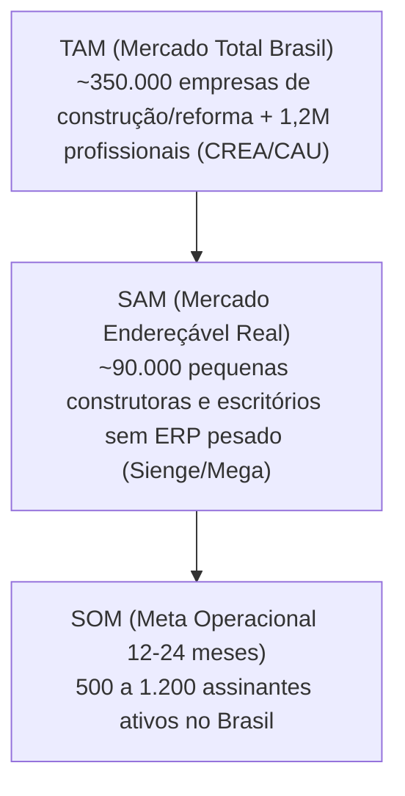
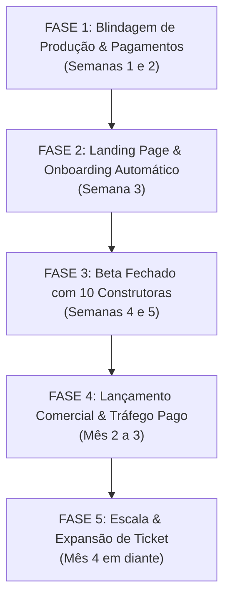

# 🚀 Master Plan: Da Validação Técnica ao Retorno Financeiro (SaaS ERP de Obras)

Este documento estabelece o **plano estratégico e operacional completo** para transformar a base atual do **ERP Leve de Obras** em um **SaaS B2B lucrativo e escalável** no mercado brasileiro de construção civil.

---

## 📊 1. Diagnóstico do Estado Atual & Gaps de Produção

### O que já está desenvolvido e funcional:
- ✅ **Frontend PWA & Web**: Dashboard executivo, Fluxo de Caixa segregado por obra, Módulo de Inadimplência com régua WhatsApp, Orçamentos integrados ao SINAPI da Caixa, Diário de Obras fotográfico e Modo Canteiro Mobile (UX rápida com botões táteis).
- ✅ **Backend REST & Multi-Tenant**: API Express em TypeScript com isolamento de dados por `tenant_id`, autenticação JWT, controle de perfis (`ADMIN`, `ENGENHEIRO`, `MESTRE_OBRA`).
- ✅ **Sincronizador SINAPI**: Job e scripts de importação da tabela oficial da Caixa Econômica Federal.
- ✅ **Database Schema**: Modelagem PostgreSQL completa com índices, chaves estrangeiras e integridade referencial.

### Gaps Críticos para Publicação Comercial:
| Área | Gap Atual | Solução Necessária |
| :--- | :--- | :--- |
| **Billing / Pagamentos** | Não há cobrança automatizada | Integração com Asaas / Stripe (PIX Recorrente + Cartão + Boleto) e bloqueio automático de inadimplentes |
| **Armazenamento de Mídia** | Upload local / mock | Integração com Cloudflare R2 ou AWS S3 para fotos de comprovantes e diário |
| **Landing Page & Aquisição** | Sem página pública de conversão | Landing page mobile-first focada na dor do cliente (vídeo demo, comparativo vs Excel, CTA de teste grátis) |
| **Onboarding Automatizado** | Criação manual de tenant no seed | Fluxo de auto-cadastro com criação de Tenant, usuário admin e template de 1ª obra guiada |
| **Infraestrutura em Nuvem** | Rodando localmente / Docker local | Deploy em Render / Railway / Hetzner + Neon/Supabase PostgreSQL gerenciado + CDN Cloudflare |
| **Segurança & Compliance** | Falta rate-limit estrito e termos | Rate-limit (express-rate-limit), Helmet, CORS de produção, Termos de Uso e Política de Privacidade (LGPD) |

---

## 🎯 2. Modelo de Negócio, Mercado & Precificação

### 2.1 Perfil de Cliente Ideal (ICP - Ideal Customer Profile)
1. **Pequenas Construtoras e Empreiteiras** (2 a 10 obras simultâneas, faturamento R$ 500k a R$ 5M/ano)
   - *Dor principal*: Mistura de dinheiro entre contas de obras diferentes, furos de orçamento e notas fiscais perdidas no canteiro.
   - *Decisor*: Sócio-proprietário ou Engenheiro Responsável.
2. **Engenheiros e Arquitetos Autônomos de Obra/Reforma** (1 a 3 obras simultâneas)
   - *Dor principal*: Perda de tempo orçando no Excel desatualizado e cobrança constrangedora de medições via WhatsApp.
3. **Mestres de Obras Empreiteiros**
   - *Dor principal*: Falta de comprovantes claros para receber medições do cliente e desorganização de equipe.

---

### 2.2 Tamanho de Mercado no Brasil (TAM / SAM / SOM)



- **Por que agora?** Os grandes ERPs (Sienge, Mega, TOTVS) custam **R$ 1.500 a R$ 5.000+/mês** com taxa de implantação de R$ 10.000+. O pequeno construtor opera no Excel ou no caderno e é negligenciado pelo mercado enterprise.

---

### 2.3 Estrutura de Planos e Preços (Tabela Comercial Sugerida)

| Plano | Preço Mensal | Preço Anual (Desc. 20%) | Limite de Obras Ativas | Usuários Inclusos | Destaques |
| :--- | :--- | :--- | :--- | :--- | :--- |
| **Plano Autônomo / Starter** | **R$ 97 /mês** | **R$ 77 /mês** (R$ 924/ano) | Até 2 obras simultâneas | 2 usuários (1 Admin + 1 Campo) | SINAPI atualizado, Canteiro Mobile, Comprovantes rápidos |
| **Plano Construtora / Pro** ⭐ *(Mais vendido)* | **R$ 247 /mês** | **R$ 197 /mês** (R$ 2.364/ano) | Até 6 obras simultâneas | 5 usuários (Admin, Engenheiro, Mestres) | Diário Fotográfico ilimitado, Régua de Inadimplência WhatsApp, Relatórios PDF |
| **Plano Escala / Enterprise** | **R$ 497 /mês** | **R$ 397 /mês** (R$ 4.764/ano) | Obras ilimitadas | Usuários ilimitados | BDI multi-nível, Suporte VIP via WhatsApp, Logo personalizada em relatórios |

> [!TIP]
> **Estratégia de Entrada (Trial)**: 7 dias de teste grátis sem cartão de crédito. No 5º dia, envio de automação WhatsApp demonstrando o relatório gerado da obra dele.

---

## 📈 3. Projeção Financeira & Unit Economics

### 3.1 Métricas SaaS Projetadas

| Métrica | Estimativa Conservadora | Estimativa Otimista | Benchmark de Mercado |
| :--- | :--- | :--- | :--- |
| **Ticket Médio (ARPU)** | R$ 195,00 /mês | R$ 260,00 /mês | B2B Micro-SaaS |
| **CAC (Custo de Aquisição de Cliente)** | R$ 380,00 | R$ 220,00 | Tráfego Direto + Indicação |
| **Tempo Médio de Retenção (Life)** | 16 meses | 24 meses | Construção Civil (obras longas) |
| **LTV (Lifetime Value)** | **R$ 3.120,00** | **R$ 6.240,00** | Retenção anual |
| **Relação LTV / CAC** | **8.2x** *(Excelente)* | **28.3x** *(Excepcional)* | Ideal > 3x |
| **Payback do CAC** | 1.9 meses | 0.9 meses | Ideal < 6 meses |
| **Churn Mensal** | 3.8% | 2.1% | Baixo após inserção de dados |

---

### 3.2 Curva de Faturamento e Lucro (12 Meses)

```mermaid
gantt
    title Curva de Crescimento de Clientes e MRR (12 Meses)
    dateFormat  X
    axisFormat Mês %d
    
    section Validação & Piloto
    M01 : 0 Clientes | R$ 0 MRR            : 0, 1
    M02 : 10 Clientes Piloto | R$ 1.500 MRR : 1, 2
    
    section Tração Inicial
    M03 : 25 Clientes | R$ 4.875 MRR        : 2, 3
    M04 : 50 Clientes | R$ 9.750 MRR        : 3, 4
    M06 : 110 Clientes | R$ 21.450 MRR (Break-even amplo) : 5, 6
    
    section Escala Comercial
    M09 : 240 Clientes | R$ 46.800 MRR      : 8, 9
    M12 : 450 Clientes | R$ 87.750 MRR (ARR > R$ 1M) : 11, 12
```

#### Tabela de Evolução Financeira Trimestral:

| Período | Clientes Ativos | MRR (Recorrência Mensal) | ARR (Taxa Anualizada) | Custo Operacional (Infra + Ads) | Lucro Líquido Mensal Estimado |
| :--- | :--- | :--- | :--- | :--- | :--- |
| **Mês 1** (Setup & Pilotos) | 5 (Gratuitos/Beta) | R$ 0 | R$ 0 | R$ 450 | - R$ 450 |
| **Mês 3** (Lançamento Oficial) | 25 | **R$ 4.875** | R$ 58.500 | R$ 2.800 | **+ R$ 2.075** |
| **Mês 6** (Aceleração) | 110 | **R$ 21.450** | R$ 257.400 | R$ 6.500 | **+ R$ 14.950** |
| **Mês 9** (Escala) | 240 | **R$ 46.800** | R$ 561.600 | R$ 12.000 | **+ R$ 34.800** |
| **Mês 12** (Consolidação) | 450 | **R$ 87.750** | **R$ 1.053.000** | R$ 21.000 | **+ R$ 66.750 /mês** |

---

## 💰 4. Custos Reais de Operação & Infraestrutura

### 4.1 Custo de Infraestrutura & Ferramental (Fase Inicial vs Escala)

| Item / Serviço | Função | Custo Fase 1 (0-100 clientes) | Custo Fase 2 (100-500 clientes) |
| :--- | :--- | :--- | :--- |
| **Hospedagem Backend + Frontend** | Render / Railway / Hetzner VPS | ~R$ 120,00 /mês ($20 USD) | ~R$ 350,00 /mês ($60 USD) |
| **Banco PostgreSQL Gerenciado** | Neon / Supabase Pro (Backup diário) | R$ 0 a R$ 145,00 /mês ($25) | ~R$ 290,00 /mês ($50 USD) |
| **Storage de Fotos (R2/S3)** | Cloudflare R2 (Sem taxa de egress) | ~R$ 15,00 /mês | ~R$ 80,00 /mês |
| **Gateway de Pagamento (Asaas)** | Taxa por transação PIX/Boleto/Cartão | R$ 1,99 por PIX / 2.99% Cartão | Diluído no faturamento |
| **Email Transacional (Resend)** | Boas-vindas, recuperação de senha | R$ 0 (Até 3.000 emails/mês) | ~R$ 115,00 /mês ($20) |
| **Domínio + DNS Cloudflare** | `gestorobras.com.br` / `.com` | R$ 40,00 /ano | R$ 40,00 /ano |
| **WhatsApp API (Evolution/Z-API)** | Régua de cobrança automática e avisos | ~R$ 60,00 /mês | ~R$ 120,00 /mês |
| **TOTAL FIXO MENSAL ESTIMADO** | | **~R$ 340 a R$ 480 /mês** | **~R$ 995 a R$ 1.350 /mês** |

> [!IMPORTANT]
> **Ponto de Equilíbrio (Break-Even Real)**:
> Com apenas **3 clientes pagantes no Plano Construtora (3 x R$ 247 = R$ 741)** ou **5 clientes no Starter**, todos os custos de servidores, domínio, emails e banco já estão **100% pagos**. A margem bruta deste SaaS ultrapassa **85%**.

---

## 🛠️ 5. Cronograma de Implementação em 5 Fases



---

### Fase 1: Blindagem de Produção, Armazenamento & Gateway de Pagamento
- **Duração**: 10 a 14 dias.
- **Entregas Técnicas**:
  1. **Storage em Nuvem (Cloudflare R2)**:
     - Substituição do storage local por cliente S3-compatible via `@aws-sdk/client-s3` com URLs pré-assinadas ou CDN própria.
  2. **Módulo de Assinaturas & Billing (Asaas / Stripe)**:
     - Criação da tabela `subscriptions` e webhook handler (`POST /api/webhooks/asaas`).
     - Gestão de status: `TRIAL`, `ACTIVE`, `PAST_DUE`, `CANCELED`.
     - Middleware de bloqueio: impede acesso a rotas de criação se o plano estiver expirado/cancelado.
  3. **Segurança de Produção**:
     - Ativação do `helmet`, `express-rate-limit` (100 req/min por IP), sanitização de inputs e CORS restrito ao domínio oficial.
     - Migração das variáveis de ambiente para `.env.production`.

---

### Fase 2: Landing Page de Alta Conversão & Auto-Onboarding
- **Duração**: 7 dias.
- **Entregas Técnicas & Comerciais**:
  1. **Landing Page Integrada (Desktop & Mobile)**:
     - Hero com vídeo curto (30s) demonstrando: "Como o mestre lança um gasto em 5 segundos no canteiro".
     - Calculadora interativa: "Quanto sua construtora perde por mês misturando caixas?".
     - Tabela de preços transparente com botão "Iniciar Teste Grátis de 7 Dias".
  2. **Fluxo de Auto-Cadastro (Sign-up)**:
     - Formulário simples (Nome, Nome da Construtora, WhatsApp, Email, Senha).
     - Geração automática do Tenant e injeção de uma **Obra Modelo Demo** para o usuário experimentar imediatamente sem tela vazia.
  3. **Termos de Uso e Política de Privacidade**:
     - Conformidade com a LGPD e regras claras de custódia de dados de medição.

---

### Fase 3: Beta Fechado (Validação com 10 Usuários Reais)
- **Duração**: 14 dias.
- **Ações Estratégicas**:
  1. Recrutar 10 profissionais reais da sua rede (engenheiros, amigos com empreiteiras, grupos de WhatsApp de construção civil da sua região).
  2. Oferta: **Acesso 100% gratuito por 60 dias** em troca de usar em 1 obra real e realizar 1 call de feedback de 15 minutos por semana.
  3. Instalação do **Sentry** (monitoramento de erros em tempo real) e **PostHog** (mapa de calor e fluxo de uso).
  4. Ajustar arestas de usabilidade encontradas no canteiro sob sol e sinal 4G instável.

---

### Fase 4: Lançamento Comercial & Máquina de Aquisição (Go-To-Market)
- **Duração**: Mês 2 ao Mês 3.
- **Canais de Aquisição (Estratégia Multicanal)**:
  1. **Google Search Ads (Fundo de Funil - Intenção Alta)**:
     - Palavras-chave: `"sistema para controle de obras"`, `"app para mestre de obras"`, `"planilha fluxo de caixa obras vs software"`, `"tabela sinapi atualizada online"`.
     - Orçamento inicial: R$ 30 a R$ 50/dia (R$ 900 a R$ 1.500/mês).
  2. **Meta Ads (Instagram / Facebook - Vídeos de Dor)**:
     - Criativo 1: Comparativo lado a lado (Mestre enrolado com 20 notas de papel amassadas no bolso vs Mestre tirando foto no app em 3 segundos).
     - Criativo 2: "Você sabe exatamente o lucro real da sua última obra? Ou descobriu que tomou prejuízo depois que entregou a chave?".
  3. **Parcerias com Lojas de Materiais de Construção**:
     - Parceria com depósitos de materiais locais: Cupom de 20% no ERP para clientes da loja.
  4. **Prospecção Ativa (Outbound WhatsApp / Instagram)**:
     - Abordagem consultiva para perfis de pequenas construtoras e empreiteiros no Instagram.

---

### Fase 5: Retenção, Expansão de Ticket & Novos Recursos
- **Duração**: Mês 4 em diante.
- **Novos Geradores de Receita**:
  1. **Exportação de Relatório Executivo White-Label em PDF**:
     - A construtora gera o relatório fotográfico + financeiro com a própria logomarca para enviar ao cliente final (diferencial que fideliza a assinatura).
  2. **OCR com IA para Notas Fiscais**:
     - Leitura automática de valor, CNPJ e itens da foto da nota fiscal usando IA (cobrança de add-on ou incluso no plano Enterprise).
  3. **Upgrade de Planos**: Construtora que iniciou com 2 obras migra para 6 obras conforme ganha novos contratos.

---

## 🎲 6. Análise de Riscos, Probabilidades & Mitigação

| Risco Mapeado | Probabilidade | Impacto | Estratégia de Mitigação |
| :--- | :--- | :--- | :--- |
| **Resistência do Mestre de Obras em usar app** | **Alta** | **Alto** | O app já foi desenhado com botões gigantes, fluxo de 3 toques e sem menus complexos. O mestre não precisa preencher nada complexo, apenas tirar a foto e digitar o valor. |
| **Concorrência com Planilhas Excel Gratuitas** | **Média** | **Médio** | Destacar o risco de erro humano no Excel, a perda de histórico em caso de pane no PC e a facilidade do cálculo BDI/SINAPI instantâneo. |
| **Inadimplência de Assinantes SaaS** | **Média** | **Baixo** | Cobrança antecipada com bloqueio automático após 5 dias de atraso e desconto agressivo para plano Anual pago no PIX/Cartão. |
| **Custo de Tráfego Pago Alto** | **Média** | **Médio** | Focar no marketing de conteúdo orgânico (SEO no SINAPI) e parcerias com influenciadores de engenharia civil/reformas no YouTube/Instagram. |

---

## 🎯 7. Próximos Passos Imediatos para Execução

1. **Aprovação do Plano**: Validar a ordem das etapas e escopo de gateway de pagamento preferido (Asaas é o mais recomendado para o mercado brasileiro por suporte nativo a PIX com webhook instantâneo).
2. **Setup do Módulo de Assinaturas (Billing)**: Criação das tabelas de assinatura e telas de Checkout/Planos.
3. **Configuração do Bucket Cloudflare R2**: Upload em nuvem definitivo.
4. **Construção da Landing Page de Conversão**: Tela inicial para visitantes não autenticados.

---

> [!NOTE]
> Este plano foi dimensionado para possibilitar uma operação enxuta (**Bootstrap / Solo Founder** ou equipe mínima de 1-2 pessoas), com ponto de equilíbrio atingível nos primeiros 30 dias de lançamento público.
